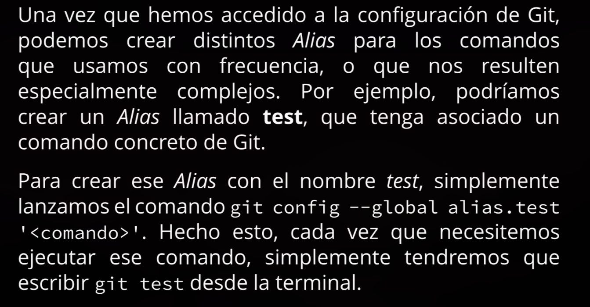

- Configuración inicial:
	- ```bash
	  git config
	  # configurar el user
	  git config --global user.name "nombre"
	  # configurar el mail
	  git config --global user.mail "name@mail.com"
	  ```
- Para empezar:
	- ```bash
	  # iniciar un git
	  git init
	  ```
- como crear ramas
	- ```bash
	  # para que las ramas que se creen por defecto sean main y no master
	  git config --global init.defautBranch main
	  # para cambiar el nombre de la rama main
	  git branch -m main
	  ```
- trabajando con git
	- ```bash
	  # para comprobar
	  git status
	  # para añadir los archivos
	  git add <el archivo>
	  # para hacer el comit y agregar un mensaje
	  git commit -m "un commit zzz"
	  # para ver los logs
	  git log
	  ```
- volver a versiones anteriores
	- ```bash
	  # volver a una version anterior
	  git checkout <archivo>
	  # volver a la ultima version completa
	  git reset
	  # para revisar el historial de commits
	  git log --graph
	  # vista rapida de los ultimos 3 commits
	  git log --graph --pretty=oneline	
	  ```
	- git reset --hard
		- es una variante radical del comando "git reset" con esto podemos eliminar todo lo que se haya hecho después del punto de retorno que le inidiquemos
		- es peligroso porque borra permanentemente cualquier cambio posterior al punto de reseteo
		- **reflog** Este comando nos muestra el historial completo
		  de todas las acciones realizadas en nuestro repositorio,
		  incluidos los commits que creíamos haber eliminado con
		  el comando git reset --hard.
		-
	- Alias
		- 
	- ```bash
	  # Representación de arbol en nuestras ramas
	  git config --global alias.tree 'log --graph --decorate --all --oneline'
	  ```
- .gitignore
	- A veces puede suceder que no queremos incluir ciertos archivos en un commit, ya sea porque son temporales, exponen información delicada, o simplemente no son relevantes para el proyecto.
	- Es un archivo de texto plano que le dice a **Git** qué archivos o carpetas **ignorar** en el proyecto.
	- Previene que archivos temporales, builds, logs o información sensible sean confirmados (committed) accidentalmente.
	- **Reglas de Sintaxis** #CheatSheet
		- **Comentarios**: Las líneas que empiezan con `#` son ignoradas.
		  `# Esto es un comentario`
		- **Archivos específicos**: Escribe el nombre completo.
		  `archivo.txt`
	- **Wildcards (Comodines)**:
	  `*`: Coincide con cero o más caracteres.
	  `*.log` (Ignora todos los archivos .log)
	  `?`: Coincide con un solo carácter.
	  `debug?.log` (Ignora debug1.log, debugA.log)
	- **Directorios**: Terminan con una barra `/`.
	  `temp/` (Ignora todo el contenido de la carpeta temp)
	- **Negación**: Usa `!` para *no* ignorar un archivo, incluso si una regla anterior lo ignora.
	  `!importante.log` (No ignorar este archivo específico)
	- **Raíz del proyecto**: Usa `/` al inicio para asegurar que solo coincida en la raíz.
	  `/todo` (Ignora el archivo 'todo' en la raíz, pero no 'src/todo')
	- **Comandos Clave** #Terminal
	- **Problema común**: Agregué un archivo al .gitignore pero Git lo sigue rastreando.
	- **Solución**: Debes borrarlo de la caché (index) de Git.
		- ```bash
		  git rm -r --cached .
		  git add .
		  git commit -m "Fix: actualizar .gitignore"
		  ```
	- Útil para ignorar archivos del sistema operativo en *todos* tus proyectos (ej. `.DS_Store` o `Thumbs.db`).
	- ```bash
	  # Dependencias
	  node_modules/
	  venv/
	  
	  # Compilados y Builds
	  dist/
	  build/
	  *.o
	  *.exe
	  
	  # Variables de entorno (IMPORTANTE)
	  .env
	  
	  # IDEs y OS
	  .vscode/
	  .idea/
	  .DS_Store
	  ```
	- link [recurso de template](https://www.toptal.com/developers/gitignore)
- git diff
	- ```bash
	  #para ver la diferencia de los archivos
	  git diff a/archivo b/archivo
	  ```
- git checkout
	- **Concepto Clave**: Este comando es polivalente (tiene dos funciones distintas) dependiendo de qué argumento le pases.
	- **1. Función "Deshacer" (Nivel Archivo)**
		- Sintaxis: `git checkout <nombre_archivo>`
		- Acción: Descarta los cambios locales en ese archivo específico, regresándolo al estado del último commit.
		- *Ejemplo*: `git checkout hello.py` (Borra lo que escribiste hoy en ese archivo).
	- **2. Función "Máquina del Tiempo" (Nivel Proyecto)**
		- Sintaxis: `git checkout <hash_del_commit>`
		- Acción: Mueve el puntero **HEAD** a un momento pasado. Todo el directorio de trabajo cambia para reflejar esa "foto" antigua.
		- Estado **Detached HEAD**: Ocurre cuando HEAD apunta a un commit específico y no a una rama (main). Estás "flotando" en el pasado.
		- *Ejemplo*: `git checkout 50a554c` (Viajas al primer commit).
	- **Cómo volver al presente**
		- Sintaxis: `git checkout <nombre_rama>`
		- Acción: Vuelve a colocar el puntero HEAD en la punta de la rama actual.
		- *Ejemplo*: `git checkout main`
- Git Tag
	- ```bash
	  git tag
	  git tag <nombre_tag>
	  git tag <nombre_tag> <hash_commit>
	  git show <nombre_tag>
	  git checkout <nombre_tag>
	  # borrar un tag
	  git tag -d <nombre_tag>
	  ```
	- el tag se agrega al commit
	- git tag, sin argumentos.
	  Para movernos entre diferentes commits usando tags,
	  podemos emplear git checkout seguido del nombre del
	  tag, por ejemplo: git checkout <nombre del tag>.
	- Los tags también nos permiten movernos rápidamente
	  a puntos específicos de nuestro repositorio sin tener
	  que buscar el hash del commit. Esto es especialmente
	  útil cuando queremos solucionar errores en versiones
	  anteriores, o trabajar sobre el código fuente de una
	  versión específica.
- Git Branch
	- ```bash
	  git branch
	  git branch <nombre_rama>
	  git switch <nombre_rama>
	  git checkout -b <nombre_rama>
	  git switch -c <nombre_rama>
	  ```
-